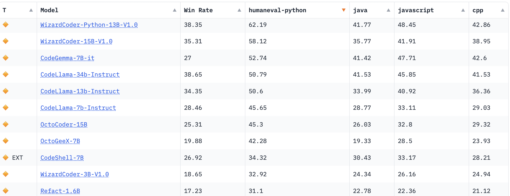

# MS Assignment

This is a re-organized repo for Yuming's MS assignment.

## 1 Env
### 1.1 LLM Inference Service

A simple command serves the model. The results of this assignment are actually obtained from this way.
```
vllm serve \
Qwen/Qwen2.5-Coder-0.5B-Instruct \
--port 8000 \
--dtype auto
```
Of course, for a more-complex project, a customized vLLM service could be nicer, but for our assignment, we are actually not handling very complex logic/model structure. We used float16 for this model. I am not sure the capability of the GPU I am using on HuggingFace Space. So let me set it in a conservative way.

### 1.2 Sandbox Dependencies
In this assignment, we use HuggingFace Space as the playground. All results can be found in this [jupyterlab space](https://huggingface.co/spaces/ymcidence/OperationMS).

Please refer to [HFDocker](./HFDocker) for all dependencies/requirements.

### 1.3 Data and Eval Tool
```
git clone https://github.com/openai/human-eval.git
pip install -e human-eval
```
## 2 Inference
The inference script is included in [notebook/run_inference.ipynb](notebook/run_inference.ipynb) using:
* `Qwen/Qwen2.5-Coder-0.5B-Instruct`

### 2.1 Prompt
The best-performing prompt is the following one
*  [data/prompt_com.txt](data/prompt_com.txt)

It is a comment-like prompt but with keywords like 'system' and 'instructions'.
I also reformatted the testing cases as additional hints in the docstring for better performance.

### 2.2 Post-Processing

We only removed those tokens that are witnessed in the input side.

## 3 Results

I still cannot produce a pass@1 above 0.5 with any 0.5B model. The best-performing-round is about
* 0.37

Please refer to the notebook for details and/or reproducing a similar result.

**Alternatively**, please run 
```
python ./human-eval/human_eval/evaluate_functional_correctness.py <ANY RESULT FILE>
```
to compute the score from a result file.

I archived some results in [./results](results/)

As mentioned in the previous email, I still feel it being hard for a 0.5B model to hit 0.5 pass@1. From the [official technical report of QWen2.5](https://arxiv.org/abs/2409.12186) and [HumanEval](https://arxiv.org/pdf/2107.03374), a model at this size obtains a pass@1 of:
* ~0.15 for codex 679M (being similar to my first submission)
* ~0.28 for QWen coder 0.5B 

This also accords what we have seen from the [HF bigcode-models-leaderboard](https://huggingface.co/spaces/bigcode/bigcode-models-leaderboard). 
The following screenshot from the leaderboard tells the level of model size in obtaining 0.5+ pass@1.



Of course, these models do not use a tailored prompt, but it seems to be hard to outperform models in the same realm with 10-20 times larger sizes only by prompt engineering.

I am really curious about how to achieve a 0.5 pass@1 with a simple implementation, even if I fail in this assignment.