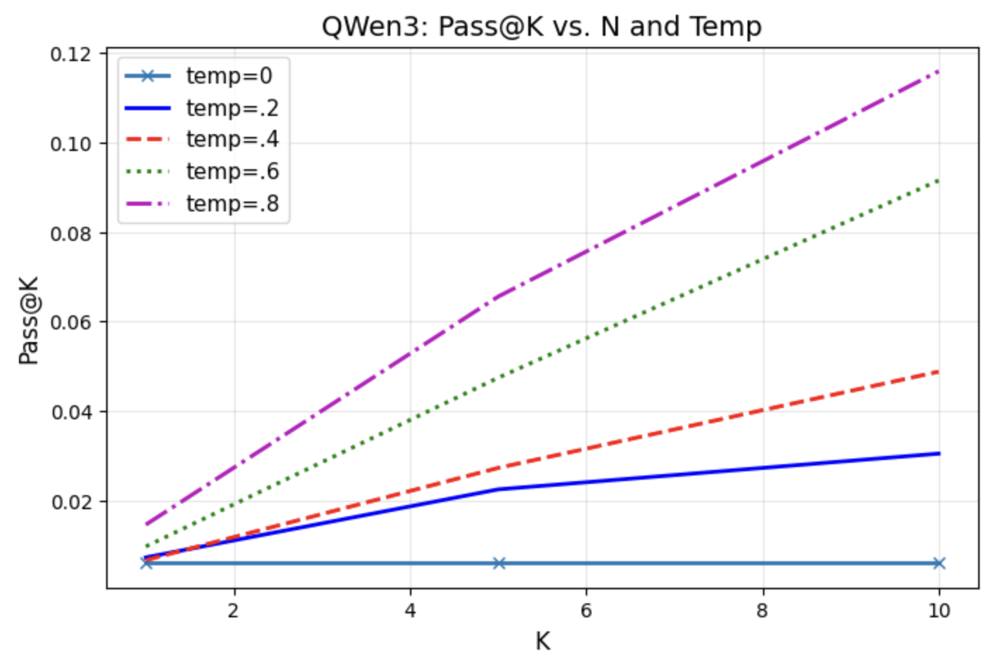
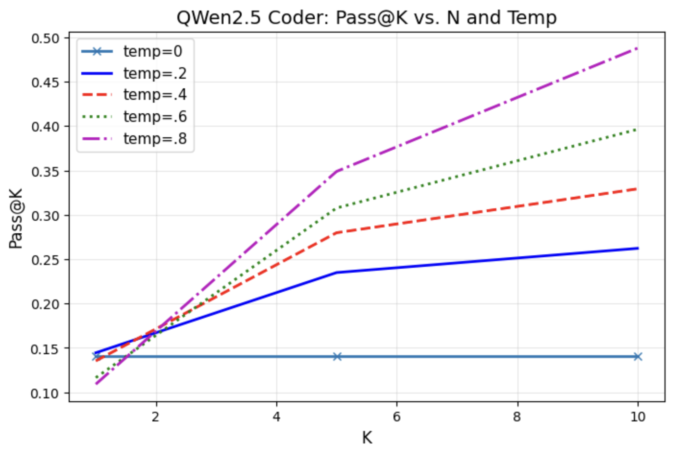
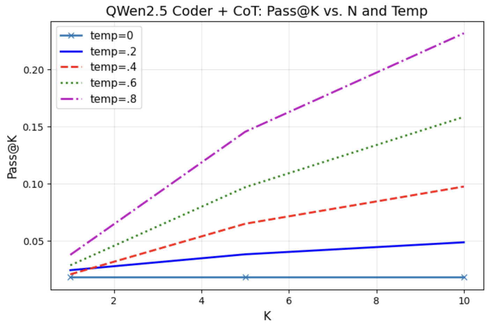

# MS Assignment

This is a re-organized repo for Yuming's MS assignment.

#### Project structure
```
data: including prompts and some resources
notebook: the notebooks to run the majority of our scripts
results: archive of inference and eval outputs
src: some source code (not many)
```

## 1 Env
### 1.1 LLM Inference Service
One can use the Dockerfile provided to start an LLM service in one container

```
docker build -t qwen_model .
docker run -p 8000:8000 qwen_model
```

**Alternatively**, a simple command will do the same thing. The results of this assignment are actually obtained from this way.
```
python -m vllm.entrypoints.api_server \
  --model Qwen/Qwen3-0.6B \
  --port 8000 \
  --dtype float16
```
Of course, for a more-complex project, a customized vLLM service could be nicer, but for our assignment, we are actually not handling very complex logic/model structure. We used float16 for this model. I am not sure the capability of the GPU I am using on HuggingFace Space. So let me set it in a conservative way.

### 1.2 Sandbox Dependencies
In this assignment, we use HuggingFace Space as the playground. All results can be found in this [jupyterlab space](https://huggingface.co/spaces/ymcidence/OperationMS).

Please refer to [HFDocker](./HFDocker) for all dependencies/requirements.

### 1.3 Data and Eval Tool
```
cd data
git clone https://github.com/maoquan-ms/coding-tasks.git
git clone https://github.com/openai/human-eval.git
pip install -e human-eval

```

This is cloning Kevin's eval data and the evaluation tool to compute Pass@K.

## 2 Inference
The inference script is included in [notebook/run_inference.ipynb](notebook/run_inference.ipynb)

We actually have tested two versions of small QWen models, including:
* `Qwen/Qwen3-0.6B`
* `Qwen/Qwen2.5-Coder-0.5B-Instruct`

They will be having slightly different prompting logics depending on their model natures.

### 2.1 Prompt

#### Qwen3-0.6B

At the beginning, we designed a CoT-like prompt (see [data/prompt_cot.txt](data/prompt_cot.txt)) and hope it can help the small model to better understand what task it is actually handling. 

However, no matter what we have done, as long as there is a preamble before the function head,the model always produces meaningless responses as follows:
```
#
pass
```
There is no escape from this output style even it is just a very short additional prompt. Prompting styles that we have tried and failed include:
* CoT
* A single formatting header emphasizing the importance of indent
* 2-round inference with the first predicting the CoT prompt for the next round code generation.
* Qwen's official prompt recommendation for math and standardized outputs: `Please reason step by step, and put your final answer within \boxed{}.`

All of them are not working well. It seems to be a problem with the model size. Our final solution is not using any additional prompt ATM, see [data/prompt_naive.txt](data/prompt_naive.txt).

#### Qwen2.5-Coder-0.5B-Instruct
This is a coder model, we find it at a similar size to QWen3-0.6B. So let's bring them together for a comprehensive view.

We also tried 2 prompts for this model, with 
* a naive one [data/prompt_coder.txt](data/prompt_coder.txt)
* a CoT-like one [data/prompt_coder_cot.txt](data/prompt_coder_cot.txt) (not very much likely to be necessary)

For both of the two, we keep the system prompt on the top `system: You are Qwen, created by Alibaba Cloud. You are a helpful assistant.`, as it was rumored that QWen2.5 series heavily reply on system prompt and it's also suggested on the QWen2.5's official model card.

### 2.2 Decoding
We perform sampling methods on the token-level categorical distributions with fixed top-p and top-k:
```
top-p: 0.85
top-k: 40
```
which is a very similar setting to the referenced paper [1], while **sampling size** and **temperature** matters more. Please see the next section for details.

### 2.3 Post-Processing

We only removed those tokens that are witnessed in the input side.

## 3 Evaluation Results

We mimicked a part of the evaluation of [1] (Fig. 5 of the paper), where we see the sampling method matters most to the final performance.

The eval script is very much cli-like and a bit adhoc. We provided it in [notebook/eval](notebook/eval.ipynb)

### 3.1 Performance by Model

#### QWen3

The naive QWen3 is not performing well. It is actually not performing code completion at all sometimes. Hence, the results here are a bit random.

Note that in a not-reported CoT trail, this QWen3 actually fails to generate any meaningful code when even a single prompt word is added. So we did not show its results.

#### QWen2.5 Coder
This is indeed good! Performance looks comparable with the baseline in [1] though the testing sets are different, but at least they are at the same level.


#### QWen2.5 Coder + CoT
Another failure case. Instruction-tuned small domain model may be not suitable to CoT-like hacks. We discuss this later in Sec. 4.2.


#### Overall
The performance trend w.r.t. sample size is reasonable and intuitive. It's like an analogy of 'having multiple trails of coding and expecting some will pass'.

### 3.2 Bset Temperature
In our experiments, a high temperature is always welcomed. However, we have tested very limited numbers of generated samples. From the red line of QWen2.5 Coder, we expect the overall trend will be the same as  Fig. 5 of [1]. 


## 4 Possible Improvements

### 4.1 Inference Efficiency:

* **Batching:** Instead of processing one request at a time, batch multiple requests into one to reduce overhead. We did not use this just because of the limited time for implementation. Sometimes batching will be helpful to a higher KV cache hit rate, which is also good for efficiency. But this is a bit beyond my own control and sometimes being somewhat metaphysics.
* **Higher Quantization Rate:** int8 serving may be another option to save efficiency. Again, if more time is given, this can be evaluated.
* **Decoding Strategy:** Pure vLLM serving does not naturally support beam search, but actually HF's GenerativeMixin supports it. Considering the need of multiple samples to get a higher pass rate in this task, introducing beam search could be an option to accelerate. In practice, the time cost for beam search will be **slightly** lower than inference in multiple times for generating the same size of samples. If it can trade off with performance, it definitely can be an option to improve inference efficiency.

On a different note, there will be actually no significant need to introduce complex fused ops as vLLM by default will use some fused ops even sometimes with AMP enabled.

### 4.2 For Better Evaluation Scores:

#### Fine-Tuning 
Fine-tuning the model on specific coding tasks or more diverse datasets of course will improve performance on HumanEval.
Instruction tuning on QWen2.5 is giving us a better performance as shown in Sec. 3 even if it's a last-gen model of QWen. 

Instruction tuning is definitely worthwhile in our case as all tasks are in python. Some quick SFT will definitely bring a difference to the model in the capability and specificity in python.

#### Do we need RL for this task?
For a code correctness benchmark task like HumanEval, I guess this is very much likely to be **YES and NO**.

Preference-based RL like DPO may not be useful. It is more likely to introduce instability, training complexity, and the risk of "reward hacking." Its benefits are far less certain than in open-ended code assistant scenarios. 

However, concepts like Reinforcement Learning from Execution Feedback (RLEF) [2,3] is definitely a promising direction. [3] already shows improvements on HumanEval and we can consider simplified versions based on this.

PS: [2] is a rejected paper, and I think sometimes the idea is a bit too straightforward as an ICLR submission. But simplicity is actually a good thing as to a real project.

#### Prompt Engineering
Another yes-and-no topic.

From the observations of the experiments in this assignment, it seems complex prompt engineering is not bring positive influence to the task. However, I think this is a bit dominated by the model size. For a larger model, perhaps CoT prompts or even ZS-prompts can be the help.

On the other side, the performance difference between simple prompt and CoT prompt for QWen2.5-Coder may suggest that an instruction-tuned DOMAIN model may not be suitable to complex prompting logics. 

In short, an educated guess regarding prompt reads:
* For general model, maybe we can have complex prompt to guide models to execute in our needed way, **but it has to be large enough** or at least not too small.
* For coder models or instruction tuned ones, let's stick to the promopts the model is used to or at most adding some example cases.

#### Multi-Round Inference
We can have several rounds of inference for:
* code correction
* context refinement
* execution trails
* etc...

Some of them may also involve concepts like AI compiler, unit testing tools, etc. An ReAct agent [4] can be the controller here to decide which tool to use for each round. This is also some SQL writing models currently are opting to.

#### Larger Model or a Suitable Model
Yes of course lager model can improve almost everything. 

Also, knowing the training data source of the LLM to be used is also essential for a better task fitment. 


### 4.3 Beyond the Current Metric
Pass@K is actually very deterministic on code correctness. It focuses more on functional behaviours. However, there are codes/programs targeting at scientific computations and sometimes the results can be slightly different on different devices. Some others may even be stochastic. For these codes, a better testing criterion could be similar to the math benchmarks of LLM leaderboards nowadays, including things like MAE.

Bleu/ROUGE scores sometimes can also be helpful, as mentioned in [1]. In this assignment, we don't have the GT code, so metrics like BLEU are not included.


-----
## Reference
[1] [Evaluating Large Language Models Trained on Code](https://arxiv.org/pdf/2107.03374)

[2] [RLEF: Grounding Code LLMs in Execution Feedback with Reinforcement Learning](https://openreview.net/forum?id=zPPy79qKWe)

[3] [Training Language Models to Self-Correct via Reinforcement Learning](https://arxiv.org/pdf/2409.12917)

[4] [ReAct: Synergizing Reasoning and Acting in Language Models](https://arxiv.org/abs/2210.03629)